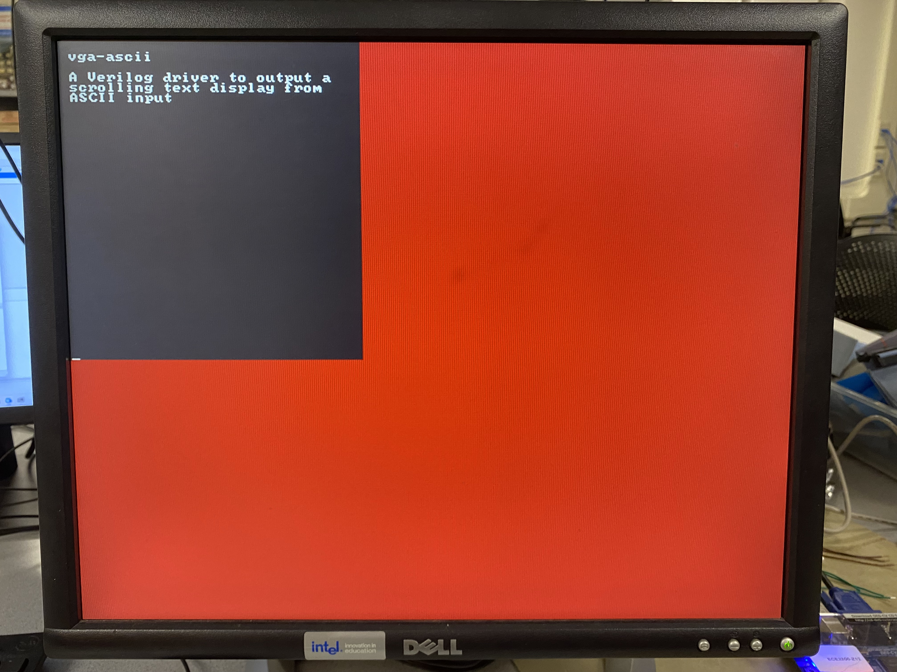

# vga-ascii

A (System)Verilog driver to output a scrolling text display from ASCII input

<p align="center">
  
</p>

## Overview

The top-level hardware module is located in `hw/CharDisplay.v`:

```verilog
module CharDisplay #(
  ...
) (
  input  logic clk_25M,
  input  logic rst,

  //----------------------------------------------------------------------
  // ASCII Interface
  //----------------------------------------------------------------------

  input  logic [7:0] ascii,
  input  logic       ascii_val,

  //----------------------------------------------------------------------
  // VGA Interface
  //----------------------------------------------------------------------

  output  logic [3:0] VGA_R,
  output  logic [3:0] VGA_G,
  output  logic [3:0] VGA_B,
  output  logic       VGA_HS,
  output  logic       VGA_VS
);
```

The module runs on a 25MHz clock for the VGA display. The character
display takes in characters on the ASCII Interface, and manipulates the
VGA Interface to display a scrolling text display of the provided ASCII
characters, as though they were typed on a keyboard. Each character is
represented by an 8x8 grid of pixels.

The character display supports all common visible characters (32 - 126, 
or `0x20 - 0x7E`, corresponding to the range from  ` ` (space) to `~`).
The following non-visible characters are additionally supported:

 - __Delete__ (`0xFF`): Deletes the last character on the current line,
   and moves the cursor back to the previous character. Deleting to the
   beginning of a line will currently stop at the beginning, and not
   proceed to earlier lines
 - __Escape__ (`0x1B`): Pressing escape will clear the screen, resetting
   the cursor and removing all characters
 - __Newline__ (`0x0A`): A newline (from hitting "Enter") will cause the
   cursor to move to the beginning of the next line

As new lines are needed (either from overflowing the current line or from
an intentional newline), previous lines will scroll up, to keep the cursor
at the bottom of the screen.

## Testing

SystemVerilog testbenches are employed to test both `CharLUT` and `CharBuf`
(with the VGA modules tested via inspection on a VGA display, due to the
difficulty of mocking a VGA minion).

The tests require the following to be installed:

 - [Verilator](https://github.com/verilator/verilator)
 - [CMake](https://cmake.org/)

The tests can be found in `tests`, and can be run from the top-level
directory with:

```bash
mkdir build
cd build

# Make the build system with CMake
cmake ..

# Build and run the CharLUT test
make -j CharLUT_test
./CharLUT_test

# Build and run all tests
make -j check
```

## Acknowledgements

The mapping of ASCII values to pixel binary values was sourced from
[font8x8](https://github.com/dhepper/font8x8), and is implemented in
`hw/CharLUT.v`